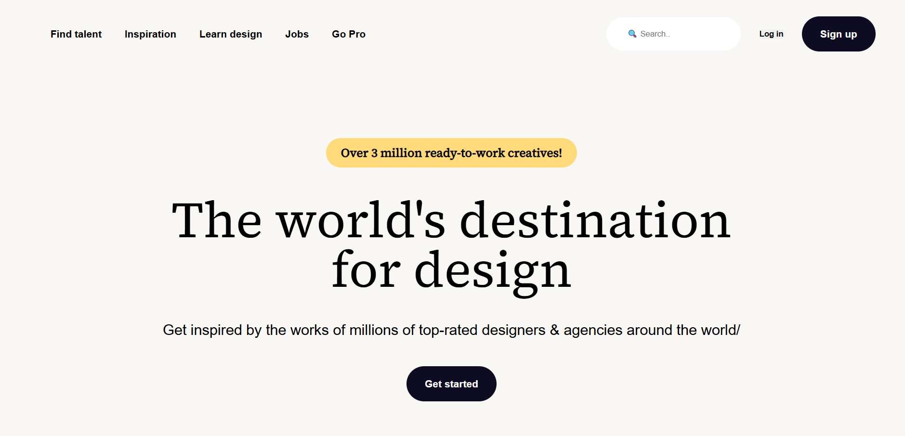

# Dribbble Clone 🎨

A simple front-end clone of the Dribbble landing page built using HTML and CSS. This project replicates the layout and styling of Dribbble's home interface to practice UI design and CSS layout techniques.

## 🚀 Live Demo

Check it out here 👉 [Dribbble Clone Live](https://adityadomle.github.io/Dribbble.com/)

## 🛠️ Built With

- HTML5  
- CSS3

## 📸 Preview

 

## 📂 Folder Structure


## ✨ Features

- Responsive design (if applicable)  
- Clean and organized code  
- Pixel-perfect recreation of the original Dribbble layout

## 🎯 Purpose

This project was created as part of a practice exercise to improve front-end development skills, especially focusing on layout, positioning, and styling using only HTML and CSS.

## 📌 How to Use

1. Clone the repository:
   ```bash
   git clone https://github.com/adityadomle/Dribbble.com.git
   ```
2. Open `index.html` in your browser.

## 🙌 Acknowledgements

- Inspired by the [Dribbble](https://dribbble.com/) website design.